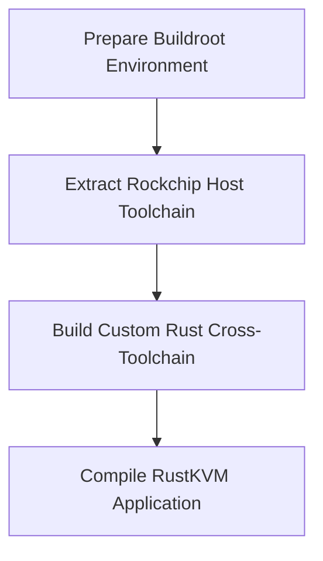

# RustKVM

RustKVM is a high-performance, specialized KVM-over-IP solution designed for the RK3588 platform. It deeply integrates Rockchip MPP hardware acceleration technology and leverages WebRTC to deliver a low-latency, high-definition remote control experience.

---

## Key Features

- **Hardware-Accelerated Encoding**: Native support for H.264 and H.265 hardware video encoding via Rockchip MPP (supporting up to 4K@60fps), significantly reducing CPU overhead.
- **Low-Latency Streaming**: Utilizes WebRTC for efficient video and audio transmission, ensuring fluid interactive feedback.
- **Service Discovery & Management**: Integrated mDNS for automatic service discovery and Prometheus metrics for comprehensive system monitoring.
- **Robust System Architecture**: Features a hardware watchdog and high-precision time synchronization for industrial-grade reliability.
- **Secure Communication**: Full TLS encryption support and a high-performance web interface built on the Salvo framework.
- **Peripheral Passthrough**: Advanced USB state management and display output control.

---

## Project Structure

```text
rustkvm
  ├── rustkvm           # Core application source code
  ├── rust              # Tailored Rust toolchain for cross-compilation
  └── assets            # Static assets and images
```

---

## Build Guide

Due to the specialized nature of the RK3588 platform, this project requires a specific cross-compilation environment. Follow the phases below for a successful build:

### Build Pipeline Overview



### 1. Prerequisites

Ubuntu 24.04 (WSL2 supported) is recommended. Install the following essential dependencies:

```bash
sudo apt update
sudo apt install pkg-config gcc-arm-linux-gnueabihf clang llvm-dev libclang-dev unzip \
  build-essential zstd device-tree-compiler gperf libnl-3-dev libdbus-1-dev \
  libelf-dev libmpc-dev dwarves bc openssl flex bison libssl-dev python3 \
  python-is-python3 texinfo kmod cmake
```

### 2. Phase 1: Extract Buildroot Environment

Extract `buildroot-rk3588-20250527.tar` and execute the build script to obtain the cross-compilation host toolchain.

> [!WARNING]
> Do NOT extract this tarball on non-Linux systems (e.g., Windows native filesystems) as it may damage file symbolic links.

```bash
mkdir -p buildroot-rk3588-20250527 && tar -xf buildroot-rk3588-20250527.tar -C buildroot-rk3588-20250527
cd buildroot-rk3588-20250527
./build.sh rk3588.mk
```

Once the build is complete, install the generated toolchain to the target directory:

```bash
sudo mkdir -p /opt/rk3588-buildkit
sudo cp -r $PWD/buildroot/output/rockchip_rk3588/host/* /opt/rk3588-buildkit/
```

### 3. Phase 2: Configure Custom Rust Toolchain

To support Aarch64 cross-compilation, configure and build the customized Rust compiler:

```bash
git clone https://github.com/rust-lang/rust
cd rust
```

Create `bootstrap.toml` and configure the cross-compilation targets:

```toml
[build]
target = ["x86_64-unknown-linux-gnu", "aarch64-unknown-linux-gnu"]

[target.aarch64-unknown-linux-gnu]
cc = "/opt/rk3588-buildkit/bin/aarch64-buildroot-linux-gnu-gcc"
```

Build and link the toolchain:

```bash
./x.py build --stage 2 --host x86_64-unknown-linux-gnu --target aarch64-unknown-linux-gnu
rustup toolchain link stage2 build/x86_64-unknown-linux-gnu/stage2
```

### 4. Phase 3: Compile the Project

Navigate to the project directory and compile RustKVM using the custom toolchain:

```bash
cargo build -Z build-std --target aarch64-unknown-linux-gnu -p rustkvm
```

---

## Support & Sponsorship

If you find this project useful, please consider supporting its development.

BTC Address: `bc1q3pgq8mc7dm9vvygd7aatq4hnt7j596jcjughm3`
