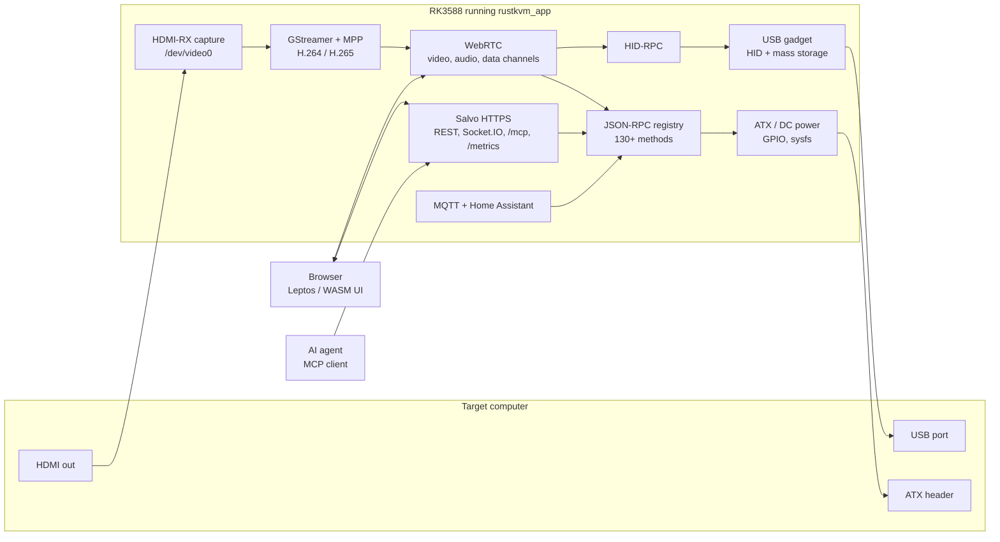
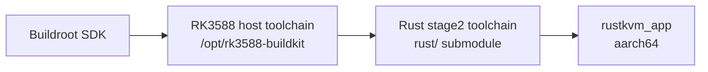

<div align="center">


# RustKVM

**Open-source KVM-over-IP for the Rockchip RK3588, written end to end in Rust.**
Control any computer from your browser at BIOS level: hardware-encoded video over WebRTC,
USB keyboard and mouse emulation, virtual media, ATX power control, and a built-in
MCP endpoint so AI agents can operate the machine too.

[](https://github.com/Rust-KVM/rustkvm/actions/workflows/ci.yml)
[](https://github.com/Rust-KVM/rustkvm/actions/workflows/web.yml)
[](LICENSE)
[](https://doc.rust-lang.org/edition-guide/rust-2024/index.html)
[](#hardware)

[Features](#features) · [Interface](#interface-overview) · [Architecture](#architecture) · [Quick start](#quick-start) · [Build](#building-from-source) · [API](#api-overview) · [Contributing](CONTRIBUTING.md) · [中文](README.zh-CN.md)

</div>

---

## What is RustKVM?

RustKVM turns an RK3588 single-board computer into an **IP-KVM**: plug its HDMI input
and USB OTG port into a target machine, and you get that machine's screen, keyboard,
mouse, storage and power button in a web browser, from boot firmware onwards, with no
software installed on the target.

It is a Rust rewrite of the device side of the [JetKVM](https://github.com/jetkvm/kvm)
approach, re-targeted at the RK3588 so the SoC's **Rockchip MPP** hardware encoder does
the video work. The backend and the browser frontend (Leptos compiled to WebAssembly)
are both Rust and share one protocol crate.

**Who it is for**

- **Homelab and server operators** who want BIOS-level remote access without a
  vendor BMC.
- **Hardware and firmware developers** who need to watch boot, flash images, and
  power-cycle boards remotely.
- **Automation and AI-agent builders**: every device action is a JSON-RPC method,
  reachable over WebRTC, plain HTTP, MQTT, or the Model Context Protocol.

> [!NOTE]
> RustKVM is under active development (workspace version `0.1.0`). There is no tagged
> release yet; build from source as described below.

## Features

### Remote console
- **Hardware-accelerated video**: H.264 or H.265 via Rockchip MPP (`mpph264enc` /
  `mpph265enc`) in a GStreamer pipeline, 60 fps by default, VBR / CBR / AVBR rate control.
- **Zero-copy streaming**: encoded frames go from GStreamer into WebRTC RTP as
  `bytes::Bytes` without a per-frame copy.
- **Low-latency WebRTC** with Opus audio, Socket.IO
  signaling, and a self-healing video pipeline that restarts with backoff.
- **Adjustable quality**, codec preference, video sleep mode, and a JPEG screenshot
  endpoint.
- **EDID control** to present a chosen display identity to the target.

### Input and USB
- **USB HID gadget**: keyboard plus absolute and relative mouse, over a compact binary
  HID-RPC protocol on reliable and unreliable WebRTC data channels.
- **Keyboard layouts** (English US/UK, German, French, Spanish, Italian, Japanese),
  lock-key LED feedback, Ctrl+Alt+Del, text typing, and saved **keyboard macros**.
- **Mouse jiggler** to keep the target awake.
- **Virtual media**: mount an ISO or disk image as a USB CD-ROM or disk, from device
  storage, an HTTP URL, a browser upload over WebRTC, or the bundled
  [netboot.xyz](https://netboot.xyz) image.

### Power and peripherals
- **ATX power control** (power / reset buttons, power and HDD LED state) through GPIO.
- **DC power extension** with on / off and restore-on-boot policy.
- **Wake-on-LAN** with a saved device list.
- **Serial console** and a **web terminal** on the device.

### Automation and integration
- **JSON-RPC 2.0 API** with 130+ methods, the same set the web UI uses.
- **MCP server** at `POST /mcp`: screenshots, typing, key combos, mouse, power and a
  generic `rpc_call` tool, so Claude and other MCP clients can drive the target machine.
- **API tokens** (`Authorization: Bearer rkvm_…`), stored only as SHA-256 hashes.
- **MQTT with Home Assistant discovery**: ATX buttons, power and HDD LEDs, DC power
  switch and voltage / current / power sensors.
- **Prometheus metrics** at `/metrics` and an aggregated health report at
  `/device/health`.
- **OpenAPI document** at `/api-doc/openapi.json` with a Scalar UI at `/scalar-ui`.

### Network and security
- **HTTPS by default** with a self-signed certificate generated at startup (`rustls` +
  `rcgen`), or a custom certificate.
- **Local auth**: password (bcrypt) or no-password mode, a first-run setup wizard, and
  rate-limited login with exponential backoff.
- **mDNS** (`rustkvm.local`), static IP or DHCP, Tailscale status and control URL, and
  optional cloud relay with OIDC.
- **Failsafe mode**, entered after a video-pipeline crash or on demand, so the device
  stays reachable for recovery.

## Interface overview

The web UI is a single-page app served by the device itself.

| Area | What you get |
| --- | --- |
| **Video view** | The live target screen. Click to capture keyboard and mouse; switch between absolute and relative pointer. |
| **Toolbar** | Fullscreen, Ctrl+Alt+Del, stream quality up and down, device audio, OCR copy of on-screen text (Tesseract.js), serial terminal, reboot, settings. |
| **Status indicators** | Caps / Num / Scroll Lock LEDs reported by the target. |
| **Settings drawer** | Features (USB emulation, mass storage, jiggler), virtual media, USB devices, video codec and sleep, EDID, keyboard layout, network (DHCP / static), Wake-on-LAN, MQTT, display rotation and backlight, SSH key, password, log level, About. |
| **Advanced settings** | ATX and DC power with restore policy, extension selection, keyboard macros, serial console, TLS (self-signed or custom), Tailscale control URL, cloud, developer mode, factory reset. |

First launch opens a **setup wizard** where you choose password or no-password mode.

<!-- Screenshots: add docs/assets/ui-console.png and docs/assets/ui-settings.png taken from a running device, then embed them here. -->

## Architecture


```mermaid
flowchart LR
    subgraph Target["Target computer"]
        HDMI[HDMI out]
        USB[USB port]
        ATX[ATX header]
    end

    subgraph Device["RK3588 running rustkvm_app"]
        CAP["HDMI-RX capture<br/>/dev/video0"] --> MPP["GStreamer + MPP<br/>H.264 / H.265"]
        MPP --> RTC["WebRTC<br/>video, audio, data channels"]
        RTC --> RPC["JSON-RPC registry<br/>130+ methods"]
        RTC --> HID["HID-RPC"]
        HID --> GADGET["USB gadget<br/>HID + mass storage"]
        RPC --> GPIO["ATX / DC power<br/>GPIO, sysfs"]
        WEB["Salvo HTTPS<br/>REST, Socket.IO, /mcp, /metrics"] --> RPC
        MQTT["MQTT + Home Assistant"] --> RPC
    end

    HDMI --> CAP
    GADGET --> USB
    GPIO --> ATX

    Browser["Browser<br/>Leptos / WASM UI"] <--> RTC
    Browser <--> WEB
    Agent["AI agent<br/>MCP client"] --> WEB
```

All transports funnel into one transport-agnostic JSON-RPC registry, so a method added
once is available to the UI, HTTP, MQTT and MCP.

### Repository layout

```text
rustkvm/
├── app/                  # device binary `rustkvm_app` (web server, video, USB, RPC, MCP, MQTT)
├── crates/
│   ├── rkvm-core/        # startup wall-clock sync, shared error types
│   ├── rkvm-net/         # mDNS, Wake-on-LAN, Tailscale CLI, local-IP discovery
│   ├── rkvm-proto/       # protocol types shared with the frontend (HID-RPC, JSON-RPC, keymaps)
│   └── rkvm-web/         # Leptos 0.8 CSR frontend, built with Trunk (not a workspace member)
├── assets/images/        # built-in virtual-media images
├── ci/buildkit/          # Docker image for the RK3588 cross-build kit
├── rust/                 # rust-lang/rust submodule for the self-built stage2 toolchain
└── dev_deploy.sh         # build and deploy to a device over SSH
```

[`AGENTS.md`](AGENTS.md) holds the full module tree, conventions and gotchas.

## Hardware

| Component | Requirement |
| --- | --- |
| SoC | Rockchip **RK3588** (aarch64), with Rockchip MPP and the `gstreamer-rockchip` plugins |
| Video in | HDMI-RX exposed as a V4L2 device (`/dev/video0` by default) |
| USB | OTG / device-mode port for the USB HID and mass-storage gadget |
| Power control | Optional ATX and DC extension boards wired to GPIO |
| OS | Buildroot-based Linux image for RK3588 (see [Building from source](#building-from-source)) |

## How it compares

RustKVM sits next to two well-known open-source IP-KVMs and borrows ideas from both.

| | **RustKVM** | [JetKVM](https://github.com/jetkvm/kvm) | [PiKVM](https://github.com/pikvm/pikvm) |
| --- | --- | --- | --- |
| Hardware | Any RK3588 board with HDMI-RX | JetKVM device | Raspberry Pi + capture board |
| Device software | Rust | Go | Python |
| Web UI | Rust / WebAssembly (Leptos) | React | JavaScript |
| License | GPL-2.0-only | GPL-2.0 | GPL-3.0 |

What RustKVM focuses on:

- **RK3588 headroom**: an 8-core SoC with a hardware H.264 / H.265 encoder, so video
  encoding stays off the CPU.
- **One language end to end**: backend, frontend and the shared protocol crate are all
  Rust, and the tree carries no hand-written C (EDID ioctls go through `rustix`).
- **Agent-ready API**: every action is a JSON-RPC method, exposed over HTTP, MQTT and a
  built-in MCP endpoint with API-token auth.

## Quick start

The full walkthrough, including flashing and wiring, is in
[docs/getting-started.md](docs/getting-started.md).

1. **Build** the frontend and the device binary (next section), or use `dev_deploy.sh`.
2. **Deploy** to the device:

   ```bash
   ./dev_deploy.sh -r <device_ip> -u root
   ```

3. **Open** `https://<device_ip>/` (or `https://rustkvm.local/`) and accept the
   self-signed certificate.
4. **Finish the setup wizard**, then click the video view to take control.

Useful runtime flags (all also settable via `RUSTKVM_*` environment variables, see
`rustkvm_app --help`):

```bash
rustkvm_app --video-encoder h265 --video-bitrate 20000000 --video-fps 60 \
            --mdns-hostname rustkvm --log-level info
```

## Building from source

RustKVM has two build products: the **WASM frontend** (any host, stable Rust) and the
**device binary** (cross-compiled for `aarch64-unknown-linux-gnu`). The frontend is
embedded into the binary at compile time, so build it first.

### 1. Frontend (any host)

```bash
rustup target add wasm32-unknown-unknown
cargo install trunk
cd crates/rkvm-web
trunk build --release      # output: crates/rkvm-web/dist/
# trunk serve              # dev server on :9000
```

### 2. Host build (x86_64, for development and tests)

The workspace compiles and tests on an x86_64 Linux host, which is what CI does. It does
not stream video there (no MPP), but it is the fastest loop for backend work.

```bash
sudo apt install libgstreamer1.0-dev libgstreamer-plugins-base1.0-dev
mkdir -p crates/rkvm-web/dist && touch crates/rkvm-web/dist/index.html   # or a real Trunk build
cargo +nightly clippy --workspace --release --all-targets -- -D warnings
cargo +nightly test --workspace
```

### 3. Device build (aarch64 / RK3588)

The production binary uses the Buildroot RK3588 host toolchain and a self-built Rust
`stage2` toolchain with `-Z build-std`.

<details>
<summary><b>Step-by-step cross-compilation setup</b></summary>


```mermaid
graph LR
    A[Buildroot SDK] --> B[RK3588 host toolchain<br/>/opt/rk3588-buildkit]
    B --> C[Rust stage2 toolchain<br/>rust/ submodule]
    C --> D[rustkvm_app<br/>aarch64]
```

**Prerequisites** (Ubuntu 24.04, WSL2 works):

```bash
sudo apt update
sudo apt install pkg-config gcc-arm-linux-gnueabihf clang llvm-dev libclang-dev unzip \
  build-essential zstd device-tree-compiler gperf libnl-3-dev libdbus-1-dev \
  libelf-dev libmpc-dev dwarves bc openssl flex bison libssl-dev python3 \
  python-is-python3 texinfo kmod cmake
```

**Buildroot host toolchain.** Extract the RK3588 Buildroot SDK on a Linux filesystem
(extracting on Windows breaks its symlinks) and build it:

```bash
mkdir -p buildroot-rk3588-20250527 && tar -xf buildroot-rk3588-20250527.tar -C buildroot-rk3588-20250527
cd buildroot-rk3588-20250527
./build.sh rk3588.mk
sudo mkdir -p /opt/rk3588-buildkit
sudo cp -r "$PWD"/buildroot/output/rockchip_rk3588/host/* /opt/rk3588-buildkit/
```

The [`buildkit`](.github/workflows/buildkit.yml) workflow can also build this toolchain
and publish it as the `ghcr.io/<owner>/rk3588-buildkit` container image.

**Rust stage2 toolchain.** In the `rust/` submodule, create `bootstrap.toml`:

```toml
[build]
target = ["x86_64-unknown-linux-gnu", "aarch64-unknown-linux-gnu"]

[target.aarch64-unknown-linux-gnu]
cc = "/opt/rk3588-buildkit/bin/aarch64-buildroot-linux-gnu-gcc"
```

then build and link it:

```bash
git submodule update --init rust
cd rust
./x build --stage 2
rustup toolchain link stage2 build/x86_64-unknown-linux-gnu/stage2
```

</details>

**Build the binary** (the `panic_abort` std variant is required because the release
profile sets `panic = "abort"`):

```bash
cargo +stage2 build -Z build-std=std,panic_abort \
  --target aarch64-unknown-linux-gnu -p rustkvm --bin rustkvm_app --release
# → target/aarch64-unknown-linux-gnu/release/rustkvm_app
```

## API overview

Every endpoint below except the public ones requires a session cookie or an
`Authorization: Bearer <api token>` header. Full details are in
[`docs/api.md`](docs/api.md).

| Interface | Endpoint | Purpose |
| --- | --- | --- |
| Web UI | `GET /` | Single-page app (embedded) |
| JSON-RPC over HTTP | `POST /device/rpc` | Call any of the 130+ RPC methods |
| MCP | `POST /mcp` | Model Context Protocol (Streamable HTTP, JSON responses) |
| WebRTC | `POST /webrtc/session`, Socket.IO `/` | Video, audio, and the `rpc` / `hidrpc` data channels |
| Screenshot | `GET /device/screenshot` | Current screen as JPEG |
| Health | `GET /device/health` | `ok` / `degraded` plus issues |
| Metrics | `GET /metrics` | Prometheus (public) |
| OpenAPI | `GET /api-doc/openapi.json`, `/scalar-ui` | HTTP API schema |

```bash
# Create an API token once (from a logged-in session), then call any method with it.
curl -k https://rustkvm.local/device/rpc \
  -H "Authorization: Bearer $RUSTKVM_TOKEN" \
  -d '{"jsonrpc":"2.0","id":1,"method":"getHealth"}'
```

Connect an MCP client such as Claude Code:

```bash
claude mcp add --transport http rustkvm https://rustkvm.local/mcp \
  --header "Authorization: Bearer $RUSTKVM_TOKEN"
```

## Documentation

- [`docs/getting-started.md`](docs/getting-started.md): flash, deploy, wire up and log in on an RK3588 board
- [`docs/api.md`](docs/api.md): HTTP, JSON-RPC, MCP, HID-RPC and metrics reference
- [`AGENTS.md`](AGENTS.md): architecture, module tree, coding conventions and gotchas
- [`CONTRIBUTING.md`](CONTRIBUTING.md): development workflow and quality gates
- [`SECURITY.md`](SECURITY.md): how to report a vulnerability
- [`CHANGELOG.md`](CHANGELOG.md): release history

## Contributing

Issues and pull requests are welcome. Read [`CONTRIBUTING.md`](CONTRIBUTING.md) first:
the project enforces `rustfmt`, `clippy -D warnings` with no `#[allow]` suppressions,
`cargo deny`, and integration tests on every PR. Please follow the
[Code of Conduct](CODE_OF_CONDUCT.md).

## Support and sponsorship

If RustKVM is useful to you, consider supporting its development.

BTC: `bc1q3pgq8mc7dm9vvygd7aatq4hnt7j596jcjughm3`

## Citing

If you use RustKVM in research or a publication, GitHub's **Cite this repository**
button (from [`CITATION.cff`](CITATION.cff)) gives a ready-made reference.

## License

RustKVM is licensed under the [GNU General Public License v2.0 only](LICENSE)
(`GPL-2.0-only`).
