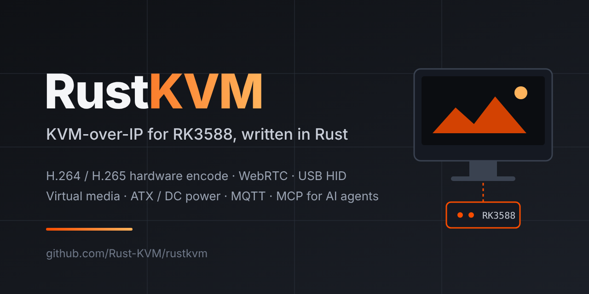

<div align="center">



# RustKVM

**基于瑞芯微 RK3588、纯 Rust 实现的开源 KVM-over-IP（IP-KVM）。**
在浏览器里以 BIOS 级权限远程控制任意电脑：硬件编码视频经 WebRTC 低延迟传输，
USB 键鼠模拟、虚拟光驱 / U 盘、ATX 电源控制，并内置 MCP 接口，让 AI 智能体也能直接操作目标机器。

[](https://github.com/Rust-KVM/rustkvm/actions/workflows/ci.yml)
[](https://github.com/Rust-KVM/rustkvm/actions/workflows/web.yml)
[](LICENSE)

[English](README.md) · [功能](#功能) · [界面](#界面概览) · [快速开始](#快速开始) · [构建](#从源码构建) · [API](#api-概览)

</div>

---

## 这是什么

RustKVM 把一块 RK3588 开发板变成 **IP-KVM**：将它的 HDMI 输入和 USB OTG 口接到目标电脑，
即可在浏览器中获得目标机的画面、键盘、鼠标、存储和电源按钮，从开机固件阶段就可用，目标机无需安装任何软件。

它沿用 [JetKVM](https://github.com/jetkvm/kvm) 的设备端思路，用 Rust 重写并移植到 RK3588，
由 SoC 内置的 **Rockchip MPP** 硬件编码器完成视频编码。后端与浏览器前端（Leptos 编译为 WebAssembly）
都是 Rust，共用同一个协议 crate。

**适合谁用**

- 想要 BIOS 级远程访问、又不想依赖厂商 BMC 的 **家庭实验室和服务器运维者**
- 需要远程看启动日志、刷镜像、给板子断电重启的 **硬件与固件开发者**
- **自动化与 AI 智能体开发者**：所有设备操作都是 JSON-RPC 方法，可经 WebRTC、HTTP、MQTT 或 MCP 调用

> [!NOTE]
> RustKVM 处于活跃开发阶段（工作区版本 `0.1.0`），尚无正式发布版本，请按下文从源码构建。

## 功能

- **硬件加速视频**：GStreamer + MPP（`mpph264enc` / `mpph265enc`）H.264 / H.265 编码，默认 60 fps，支持 VBR / CBR / AVBR
- **零拷贝推流**：编码帧以 `bytes::Bytes` 直接进入 WebRTC RTP，无逐帧内存拷贝
- **WebRTC 低延迟**：Opus 音频、Socket.IO 信令、视频管线崩溃后自动退避重启
- **USB HID**：键盘 + 绝对 / 相对鼠标，二进制 HID-RPC 走可靠与不可靠两类数据通道
- **键盘布局**（英 / 美、德、法、西、意、日）、锁定键指示灯、Ctrl+Alt+Del、文本输入、键盘宏、鼠标防休眠
- **虚拟介质**：将 ISO / 磁盘镜像以 USB 光驱或磁盘挂载，来源可以是设备存储、HTTP URL、浏览器上传或内置 [netboot.xyz](https://netboot.xyz)
- **电源控制**：ATX 开机 / 复位键与电源 / 硬盘灯状态（GPIO），DC 电源扩展及来电恢复策略，网络唤醒（WoL）
- **串口控制台与 Web 终端**、EDID 设置、屏幕截图（JPEG）、OCR 识别屏幕文字
- **JSON-RPC 2.0**：130+ 个方法，与 Web UI 使用同一套
- **MCP 服务**（`POST /mcp`）：截图、打字、组合键、鼠标、电源与通用 `rpc_call`，Claude 等 MCP 客户端可直接驱动目标机
- **API Token**（`Authorization: Bearer rkvm_…`，仅存 SHA-256 哈希）
- **MQTT + Home Assistant 自动发现**、**Prometheus 指标**（`/metrics`）、健康检查（`/device/health`）、OpenAPI（`/scalar-ui`）
- **默认 HTTPS**（启动时生成自签名证书，也可使用自定义证书）、密码 / 免密模式、首次启动向导、登录指数退避限流
- **mDNS**（`rustkvm.local`）、DHCP / 静态 IP、Tailscale、可选云中继（OIDC）、故障安全模式

## 界面概览

| 区域 | 内容 |
| --- | --- |
| **视频画面** | 目标机实时画面，点击即接管键鼠，可切换绝对 / 相对指针 |
| **工具栏** | 全屏、Ctrl+Alt+Del、画质增减、设备音频、OCR 复制屏幕文字、串口终端、重启、设置 |
| **状态指示** | 目标机上报的 Caps / Num / Scroll Lock 指示灯 |
| **设置抽屉** | 功能开关、虚拟介质、USB 设备、视频编码与休眠、EDID、键盘布局、网络、WoL、MQTT、屏幕旋转与背光、SSH 公钥、密码、日志级别、关于 |
| **高级设置** | ATX / DC 电源、扩展板、键盘宏、串口控制台、TLS、Tailscale、云、开发者模式、恢复出厂 |

## 快速开始

1. 构建前端与设备程序（见下节），或直接使用 `dev_deploy.sh`
2. 部署到设备：`./dev_deploy.sh -r <设备IP> -u root`
3. 浏览器打开 `https://<设备IP>/` 或 `https://rustkvm.local/`，接受自签名证书
4. 完成设置向导，点击画面即可开始控制

## 从源码构建

```bash
# 1. 前端（任意主机，stable Rust）
rustup target add wasm32-unknown-unknown && cargo install trunk
cd crates/rkvm-web && trunk build --release && cd -

# 2. x86_64 主机构建（开发与测试，与 CI 相同；主机上没有 MPP，不推流）
sudo apt install libgstreamer1.0-dev libgstreamer-plugins-base1.0-dev
cargo +nightly test --workspace

# 3. aarch64 设备构建（需 Buildroot RK3588 工具链 + 自建 stage2 Rust 工具链）
cargo +stage2 build -Z build-std=std,panic_abort \
  --target aarch64-unknown-linux-gnu -p rustkvm --bin rustkvm_app --release
```

交叉编译环境的完整搭建步骤见 [英文 README](README.md#3-device-build-aarch64--rk3588)。

## API 概览

除公开接口外，均需登录 Cookie 或 `Authorization: Bearer <API token>`。详见 [`docs/api.md`](docs/api.md)。

```bash
curl -k https://rustkvm.local/device/rpc \
  -H "Authorization: Bearer $RUSTKVM_TOKEN" \
  -d '{"jsonrpc":"2.0","id":1,"method":"getHealth"}'

# 将设备接入 Claude Code 等 MCP 客户端
claude mcp add --transport http rustkvm https://rustkvm.local/mcp \
  --header "Authorization: Bearer $RUSTKVM_TOKEN"
```

## 参与贡献

欢迎提交 Issue 与 PR，请先阅读 [`CONTRIBUTING.md`](CONTRIBUTING.md) 与 [行为准则](CODE_OF_CONDUCT.md)。
安全问题请按 [`SECURITY.md`](SECURITY.md) 私下报告。

## 许可证

[GPL-2.0-only](LICENSE)
